# DOGE VSM Documentation

## Department of Government Efficiency - Vector Symbolic Memory Implementation

The DOGE VSM system is an AI-powered government efficiency analysis platform built using the Vector Symbolic Memory (VSM) architecture. It analyzes city department configurations and generates intelligent consolidation recommendations to reduce waste, eliminate redundancies, and optimize resource allocation.

## Architecture Overview

The DOGE VSM system implements the complete VSM paradigm with five core components:

1. **Identity System** - Defines purpose and invariants
2. **Intelligence System** - AI-powered analysis and decision making
3. **Operations System** - Five specialized tools for data processing
4. **Governance System** - Quality control and policy enforcement
5. **Coordination System** - Workflow orchestration and message handling

## System Architecture Diagram



## Data Flow Diagram



## Control Flow Diagram


## Tool Execution Flow



## Message Bus Architecture


## File System Architecture


## Data Structures

### Department Data Structure
```ruby
{
  file: "utilities_department.yml",
  name: "utilities_department",                    # snake_case identifier
  display_name: "Utilities",                       # Human-readable name
  description: "Maintains city utility infrastructure...",
  invariants: ["serve citizens efficiently", ...], # Operating principles
  capabilities: ["Respond to power outages", ...], # What it can do
  message_types: {                                  # Communication config
    subscribes_to: ["health_check_message", ...],
    publishes: ["power_outage_report", ...]
  },
  routing_rules: { ... },                          # Message routing logic
  message_actions: { ... },                        # Action handlers
  action_configs: { ... },                         # Handler configurations
  ai_analysis: { enabled: true, context: "..." },  # AI integration
  logging: { level: "info", statistics_interval: 300 },
  keywords: ["utility", "power", "infrastructure"], # Extracted keywords
  resources: { ... },                               # Resource management
  integrations: { ... },                           # Service dependencies
  custom_settings: { ... },                        # Department-specific config
  validation: {                                     # Template validation results
    valid: true,
    errors: [],
    warnings: [],
    completeness_score: 85.5
  }
}
```

### Consolidation Input Structure
```ruby
{
  consolidations: {
    "Water & Utilities Management" => {             # New department display name
      old_department_names: [                       # snake_case names to merge
        "water_management_department",
        "utilities_department"
      ],
      reason: "Both departments manage utility infrastructure...",
      enhanced_capabilities: [                      # Synergistic capabilities
        "Unified water infrastructure management...",
        "Cross-trained emergency response teams...",
        "Integrated monitoring systems..."
      ]
    }
  }
}
```

### Tool Result Structure
```ruby
{
  success: true,
  total_consolidations: 3,
  successful_consolidations: 3,
  consolidations: [
    {
      success: true,
      new_department_name: "Water & Utilities Management",
      yaml_file: "water_utilities_management_department.yml",
      merged_departments: [
        { name: "water_management_department", file: "..." },
        { name: "utilities_department", file: "..." }
      ],
      doged_files: [
        { original: "water_management_department.yml", archived: "..." },
        { original: "utilities_department.yml", archived: "..." }
      ],
      capabilities_count: 15
    }
  ],
  summary: {
    new_department_files: ["water_utilities_management_department.yml", ...],
    total_departments_merged: 6,
    total_capabilities: 33
  },
  errors: []
}
```

## Key Features

### 1. AI-Powered Analysis
- Uses LLM providers (OpenAI, Ollama, etc.) for intelligent department analysis
- Identifies capability overlaps, functional similarities, and consolidation opportunities
- Generates detailed reasoning for each recommendation

### 2. Template-Driven Architecture
- `generic_department.yml.example` ensures consistent department structure
- `consolidated_department.yml.example` provides exact AI input format specification
- Template validation ensures compliance across all department configurations

### 3. Quality Assurance
- Governance system validates analysis quality and recommendation value
- Template validation ensures structural compliance
- Name sanitization prevents configuration conflicts
- Policy enforcement maintains quality standards

### 4. Comprehensive Tool Suite
- **LoadDepartmentsTool**: Parses and validates YAML configurations
- **RecommendationGeneratorTool**: Generates analysis and cost estimates
- **CreateConsolidatedDepartmentsTool**: Creates merged department files
- **TemplateValidationTool**: Validates configuration compliance
- **DepartmentTemplateGeneratorTool**: Generates new department templates

### 5. Robust Workflow Management
- Async processing with timeout detection
- Real-time status updates and progress tracking
- Comprehensive logging and error handling
- Message-driven architecture for extensibility

## Usage

### Basic Execution
```bash
ruby doge_vsm.rb
```

### With Custom Provider/Model
```bash
DOGE_LLM_PROVIDER=ollama DOGE_LLM_MODEL=llama3.2:1b ruby doge_vsm.rb
```

### With Debug Output
```bash
VSM_DEBUG_STREAM=1 ruby doge_vsm.rb
```

## Output Files

The system generates several types of output:

1. **Consolidated Departments**: New YAML files combining multiple departments
2. **Archived Originals**: Original files renamed with `.doged` suffix
3. **Logs**: Detailed execution logs in `log/doge_vsm.log`
4. **Status Updates**: Real-time progress via terminal status line

## Integration Points

### SmartMessage Integration
- Compatible with SmartMessage city scenario system
- Generated departments can be deployed as SmartMessage services
- Maintains message routing and communication patterns

### VSM Architecture Benefits
- Separation of concerns across five VSM systems
- Tool-based architecture enables testing and reuse
- AI integration ready for advanced reasoning
- Policy enforcement ensures quality standards
- Async processing foundation for scalability

This documentation provides a comprehensive understanding of the DOGE VSM system architecture, data flows, and operational patterns.
