# Generic Department Program Analysis

## Overview

The Generic Department program (`generic_department.rb`) is a VSM-based configurable city department template that uses YAML configuration files to dynamically become any type of city department. It integrates the SmartMessage framework for Redis pub/sub messaging and the VSM (Vector Symbolic Memory) framework for AI agent capabilities.

## Architecture Components

The program consists of several interconnected layers:
- **Configuration Layer**: YAML-driven department specification
- **VSM Integration Layer**: Five VSM systems (Identity, Governance, Intelligence, Operations, Coordination)
- **SmartMessage Layer**: Redis pub/sub messaging system
- **Monitoring Layer**: Health checks, logging, and statistics

---

## Data Flow Diagrams

### 1. System Initialization Data Flow

### 2. Message Processing Data Flow

### 3. VSM Capsule Internal Data Flow

### 4. Health Monitoring Data Flow

---

## Control Flow Diagrams

### 5. Program Initialization Control Flow

### 6. Message Subscription Control Flow

### 7. VSM Intelligence Processing Control Flow

### 8. VSM Operations Execution Control Flow

### 9. Health Check Response Control Flow

### 10. Graceful Shutdown Control Flow

---

## Key Integration Points

### SmartMessage Integration
- **Message Classes**: Dynamically loaded based on YAML configuration
- **Subscriptions**: Automatic setup for configured message types
- **Publishing**: Response messages sent through SmartMessage framework
- **Headers**: Automatic routing information (`from`, `to`, `reply_to`)

### VSM Integration
- **Five Systems**: Each department gets complete VSM capsule with all five systems
- **Message Bus**: Internal VSM message bus for inter-system communication
- **DSL Configuration**: Declarative capsule setup with role injection
- **AI Integration**: Optional AI analysis through Intelligence system

### Configuration-Driven Behavior
- **YAML Config**: Complete department behavior defined in YAML
- **Dynamic Loading**: Message classes loaded based on configuration
- **Action Mapping**: Message types mapped to specific actions
- **Response Templates**: Configurable response generation
- **Priority Handling**: Message priority assignment through routing rules

### Monitoring and Observability
- **Health Checks**: Automatic health monitoring and reporting
- **Statistics**: Comprehensive operational metrics
- **Logging**: Multi-level logging with configurable verbosity
- **Status Line**: Real-time terminal status updates
- **Performance Tracking**: Response time and success rate monitoring

This architecture enables the same generic program to function as any city department by simply changing the YAML configuration file, making it highly reusable and maintainable.

<function_calls>
<invoke name="TodoWrite">
<parameter name="todos">[{"content": "Examine generic_department.rb and related files", "status": "completed", "activeForm": "Examining generic_department.rb and related files"}, {"content": "Review VSM library structure and integration", "status": "completed", "activeForm": "Reviewing VSM library structure and integration"}, {"content": "Review SmartMessage library structure", "status": "completed", "activeForm": "Reviewing SmartMessage library structure"}, {"content": "Create data flow diagrams", "status": "completed", "activeForm": "Creating data flow diagrams"}, {"content": "Create control flow diagrams", "status": "completed", "activeForm": "Creating control flow diagrams"}, {"content": "Write explanatory text for diagrams", "status": "completed", "activeForm": "Writing explanatory text for diagrams"}, {"content": "Create generic_department.md file", "status": "completed", "activeForm": "Creating generic_department.md file"}]